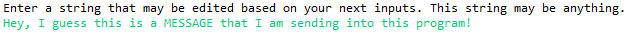
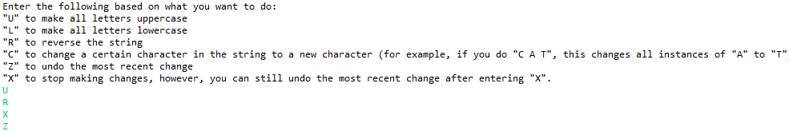
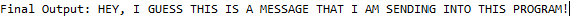

# StringManipulator
A simple Java program that can take a user's input and manipulate that input based on a user's instructions. This project uses a stack to account for every letter within a the user's message.
________________________________________________________________________________________________________________________________

**For example, say a user inputs "Hey, I guess this is a MESSAGE that I am sending into this program!":**

**Then, you can enter in specific instructions to manipulate this message:**

**Based on the commands "U R X Z", the message is changed so that the final message is this:**

